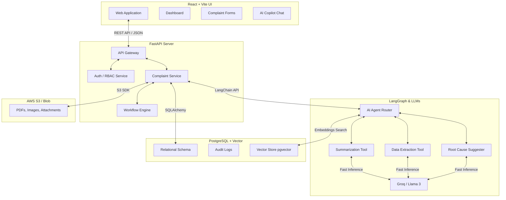

# 13. SYSTEM ARCHITECTURE

A robust, enterprise-grade architecture separating concerns into Frontend, Backend, AI Layer, and Database.

## Component Breakdown
*   **Frontend (React/Vite):** Delivers a fast, responsive Single Page Application (SPA). Handles client-side validation and rich UI interactions.
*   **Backend (FastAPI):** Python-based asynchronous framework. Acts as the orchestrator. Validates inputs (Pydantic), manages business logic, enforces 21 CFR Part 11 electronic signatures, and communicates with the database.
*   **AI Layer (LangGraph + Groq):** LangGraph manages the agentic workflow (e.g., routing an uploaded PDF to the extraction tool, then summarizing it). Groq provides ultra-fast LLM inference (e.g., Llama 3) necessary for real-time user assistance.
*   **Database (PostgreSQL + pgvector):** PostgreSQL stores structured relational data (complaints, users, audit logs). `pgvector` enables semantic search, allowing the AI to find "similar complaints" using embeddings.
*   **Storage (S3):** Secure, immutable storage for attachments and evidentiary files.

---

# 14. DATABASE PLANNING

## Entities

1.  **User**
    *   `id`, `username`, `password_hash`, `role_id`, `is_active`, `created_at`
2.  **Role**
    *   `id`, `name`, `permissions`
3.  **Complaint**
    *   `id`, `display_id` (e.g., CMP-001), `customer_id`, `product_id`, `status_id`, `description`, `ai_summary`, `risk_score`, `assigned_to`, `created_at`
4.  **Customer**
    *   `id`, `name`, `type`, `email`, `phone`, `country`
5.  **Product**
    *   `id`, `name`, `dosage`, `active_ingredient`
6.  **Investigation**
    *   `id`, `complaint_id`, `root_cause`, `findings`, `capa_required`, `approved_by`, `approved_at`
7.  **Attachment**
    *   `id`, `complaint_id`, `file_name`, `s3_url`, `uploaded_by`, `uploaded_at`
8.  **AuditLog (Immutable)**
    *   `id`, `table_name`, `record_id`, `action` (INSERT/UPDATE), `old_values` (JSON), `new_values` (JSON), `user_id`, `timestamp`, `justification`
9.  **AIRecord**
    *   `id`, `complaint_id`, `ai_prompt`, `ai_response`, `confidence_score`, `user_accepted` (Boolean)

## Relationships
*   A `Customer` can have many `Complaints` (1:N).
*   A `Product` can have many `Complaints` (1:N).
*   A `Complaint` has exactly one `Investigation` (1:1).
*   A `Complaint` can have many `Attachments` (1:N).
*   A `Complaint` can have many `AuditLogs` (1:N).

---

# 15. API PLANNING

A RESTful API design.

| Endpoint | Method | Purpose | Request Body | Response |
| :--- | :--- | :--- | :--- | :--- |
| `/api/auth/login` | POST | Authenticate user and return JWT. | `username`, `password` | `token`, `role` |
| `/api/complaints` | GET | Fetch paginated complaints list. | (Query params: status, page) | List of Complaint Objects |
| `/api/complaints` | POST | Create a new complaint. | Complaint Data | `201 Created`, New ID |
| `/api/complaints/{id}` | GET | Fetch full complaint details. | None | Complaint + Investigation Obj |
| `/api/complaints/{id}/status` | PATCH | Update complaint workflow status. | `new_status`, `signature` | `200 OK` |
| `/api/ai/extract` | POST | Extract data from uploaded file. | `file` (Multipart/form-data) | Extracted JSON entities |
| `/api/ai/summarize` | POST | Generate a summary of text. | `text` | `summary` string |
| `/api/ai/chat` | POST | Ask the AI Copilot a question. | `query`, `context` | `response` string |
| `/api/audit/{id}` | GET | Get 21 CFR Part 11 audit trail. | None | List of AuditLog Objects |

---

# 16. SECURITY

Enterprise pharmaceutical systems require military-grade security.

*   **Authentication:** JWT (JSON Web Tokens) with 15-minute expiration and secure HttpOnly refresh tokens. Integration with Corporate Active Directory / SAML.
*   **Authorization (RBAC):** Middleware checks the user's role on every API request. A Customer Care Rep hitting `PATCH /api/complaints/1/status` to 'Close' will receive a `403 Forbidden`.
*   **Audit Logs (Part 11):** Implemented at the database ORM level (e.g., SQLAlchemy Event Listeners). Any change to a model automatically writes a diff to the `AuditLog` table. This cannot be bypassed by application code.
*   **Electronic Signatures:** For critical transitions (e.g., Approving an Investigation), the frontend requires the user to re-type their password. The backend verifies the password before committing the status change.
*   **File Upload Validation:** All uploaded files are scanned for malware using a backend service (e.g., ClamAV) and strictly checked against allowed MIME types (PDF, JPG, PNG).
*   **Secrets Management:** API keys (Groq, Database credentials) are never hardcoded. They are injected via secure environment variables (`.env`) or AWS Secrets Manager.

---

# 17. UI PLANNING

A clean, enterprise UI designed for data density and reduced cognitive load.

*   **Theme:** Minimalist, high-contrast. Predominantly white/light-gray backgrounds with deep blue primary accents (conveys trust and medical professionalism).
*   **Layout:**
    *   **Sidebar (Left):** Persistent navigation (Dashboard, Complaints, Investigations, Reports, Settings).
    *   **Header (Top):** Global search, User Profile, Notifications.
    *   **Main Content (Center):** Data grids and forms.
*   **Dashboard:**
    *   KPI Cards at the top (Open Complaints, Critical Risks, Overdue Investigations).
    *   A dynamic bar chart showing complaints by Product over time.
    *   A "My Tasks" list.
*   **Complaint Form:**
    *   Split into logical accordions or tabs (Customer, Product, Description, AI Assessment).
    *   Sticky action bar at the bottom (Save Draft, Submit, Request Approval).
*   **Tables:** 
    *   Sortable, filterable data grids for viewing hundreds of records.
    *   Color-coded badges for Risk (Red = Critical, Yellow = Major, Green = Minor) and Status.
*   **AI Assistant:** A floating, collapsible chat widget in the bottom right corner, available on every screen.
*   **Typography:** Modern, highly legible sans-serif font (e.g., Inter, Roboto).

---

# 20. DEVELOPMENT ROADMAP

## Phase 1: Research & Scaffolding (Days 1-2)
*   Finalize software requirements and domain research.
*   Scaffold React (Vite) frontend and FastAPI backend.
*   Design database schema (`schema.sql`).

## Phase 2: Core Infrastructure (Days 3-5)
*   Set up PostgreSQL database and SQLAlchemy ORM.
*   Implement JWT Authentication and RBAC.
*   Implement the universal Audit Log mechanism (21 CFR Part 11 backbone).

## Phase 3: Complaint Module CRUD (Days 6-8)
*   Build backend REST APIs for creating, reading, and updating complaints.
*   Develop the Frontend Dashboard and Complaint Intake forms.
*   Implement state machine for workflow status transitions.

## Phase 4: AI Integration (Days 9-11)
*   Integrate LangGraph and Groq APIs.
*   Build AI endpoints (`/extract`, `/summarize`, `/chat`).
*   Wire AI responses directly into the frontend form UI (e.g., "Auto-fill with AI" button).

## Phase 5: Polish & Testing (Days 12-13)
*   Implement UI refinements (Vanilla CSS, loading states, error handling).
*   Write unit tests for critical business rules.
*   Perform security checks (input validation, RBAC verification).

## Phase 6: Deployment & Demo (Day 14)
*   Deploy backend (Render/Heroku/AWS).
*   Deploy frontend (Vercel/Netlify).
*   Seed database with realistic pharmaceutical dummy data for the presentation.
*   Prepare Demo Script focusing on the "Aha!" moments of AI integration.
