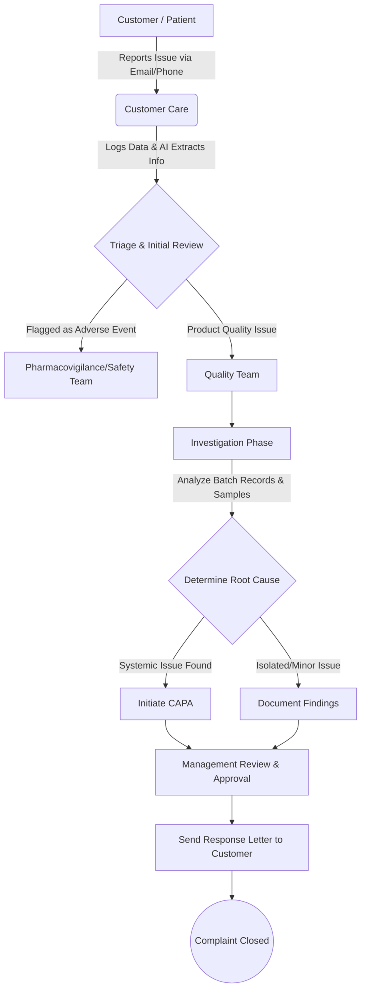

# 5. REAL-WORLD WORKFLOW

This section details the end-to-end, real-world lifecycle of a pharmaceutical customer complaint from the moment it is received to the moment it is officially closed.

## 1. Customer Submission
*   **Actor:** Customer, Patient, Pharmacist, or Doctor.
*   **Action:** The user experiences a defect (e.g., "The safety seal on my medicine bottle was broken") and contacts the company via an online portal, email, or a phone call to a call center.

## 2. Customer Care (Intake)
*   **Actor:** Customer Care Representative.
*   **Action:** The rep receives the communication. In a traditional system, they manually type everything into a form. 
*   **AI Intervention:** The AI scans the email/audio transcript, automatically extracts the Lot Number, Product Name, and defect description, and populates the electronic intake form. It also flags if the text mentions a medical emergency (Adverse Event).
*   **Output:** A formally registered Complaint ID is generated.

## 3. Quality Team (Triage & Assessment)
*   **Actor:** QA Executive.
*   **Action:** The QA team receives the new complaint in their dashboard. They perform a risk assessment (Critical, Major, Minor). They decide if an investigation is required according to SOPs. If it is a known, previously investigated issue (e.g., a known cosmetic defect on a specific batch), they may close it immediately with a reference to the prior investigation.
*   **AI Intervention:** The AI suggests a risk classification based on historical data and alerts the QA Executive if similar complaints have been filed for this specific Lot Number recently.

## 4. Investigation
*   **Actor:** QA/QC Investigator.
*   **Action:** The investigator requests the customer to send back the defective sample (if possible). They pull the retained samples (backup samples kept in the lab) for the same Lot Number and test them. They also review the Electronic Batch Manufacturing Records (eBMR) to see if any alarms went off on the manufacturing line that day.

## 5. Root Cause Analysis (RCA)
*   **Actor:** Investigator & Cross-functional teams (Engineering, Production).
*   **Action:** The team uses tools like the "5 Whys" or "Fishbone Diagram" to figure out exactly why the defect happened.
*   **Example:** Why was the seal broken? -> Because the glue didn't hold. -> Why didn't the glue hold? -> Because the heating element on Machine 4 was running 10 degrees too cold.
*   **AI Intervention:** The AI queries the database of historical deviations and suggests: *"Historically, 90% of seal failures on Machine 4 are due to heating element calibration drifting."*

## 6. CAPA (Corrective and Preventive Action)
*   **Actor:** QA Manager & Production Manager.
*   **Action:** Now that the root cause is known, the company must fix it. 
    *   *Corrective:* Quarantine any remaining bottles from that batch in the warehouse.
    *   *Preventive:* Schedule a weekly calibration check for Machine 4's heating element and update the maintenance SOP.

## 7. Management Approval
*   **Actor:** Quality Director / Authorized Qualified Person (QP).
*   **Action:** A senior manager reviews the entire electronic trail: the original complaint, the lab results, the root cause logic, and the CAPA plan. If everything is scientifically sound and compliant with regulations, they apply their Electronic Signature (compliant with 21 CFR Part 11) to approve the investigation.

## 8. Complaint Closed
*   **Actor:** Customer Care / Regulatory Affairs.
*   **Action:** A formal response letter is generated and sent to the customer explaining the findings (without revealing proprietary manufacturing secrets). The digital record is locked and archived. It remains available for future FDA audits and annual product quality reviews.
