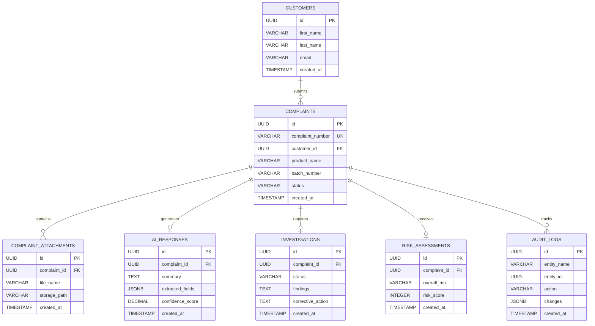

# Entity Relationship Diagram (ERD)

This is the Mermaid diagram representation of our QMS Database schema.

```mermaid
erDiagram
    CUSTOMERS ||--o{ COMPLAINTS : submits
    COMPLAINTS ||--o{ COMPLAINT_ATTACHMENTS : contains
    COMPLAINTS ||--o| AI_RESPONSES : generates
    COMPLAINTS ||--o| INVESTIGATIONS : requires
    COMPLAINTS ||--o| RISK_ASSESSMENTS : receives
    COMPLAINTS ||--o{ AUDIT_LOGS : tracks

    CUSTOMERS {
        UUID id PK
        VARCHAR first_name
        VARCHAR last_name
        VARCHAR email
        TIMESTAMP created_at
    }

    COMPLAINTS {
        UUID id PK
        VARCHAR complaint_number UK
        UUID customer_id FK
        VARCHAR product_name
        VARCHAR batch_number
        VARCHAR status
        TIMESTAMP created_at
    }

    COMPLAINT_ATTACHMENTS {
        UUID id PK
        UUID complaint_id FK
        VARCHAR file_name
        VARCHAR storage_path
        TIMESTAMP created_at
    }

    AI_RESPONSES {
        UUID id PK
        UUID complaint_id FK
        TEXT summary
        JSONB extracted_fields
        DECIMAL confidence_score
        TIMESTAMP created_at
    }

    INVESTIGATIONS {
        UUID id PK
        UUID complaint_id FK
        VARCHAR status
        TEXT findings
        TEXT corrective_action
        TIMESTAMP created_at
    }

    RISK_ASSESSMENTS {
        UUID id PK
        UUID complaint_id FK
        VARCHAR overall_risk
        INTEGER risk_score
        TIMESTAMP created_at
    }

    AUDIT_LOGS {
        UUID id PK
        VARCHAR entity_name
        UUID entity_id
        VARCHAR action
        JSONB changes
        TIMESTAMP created_at
    }
```
